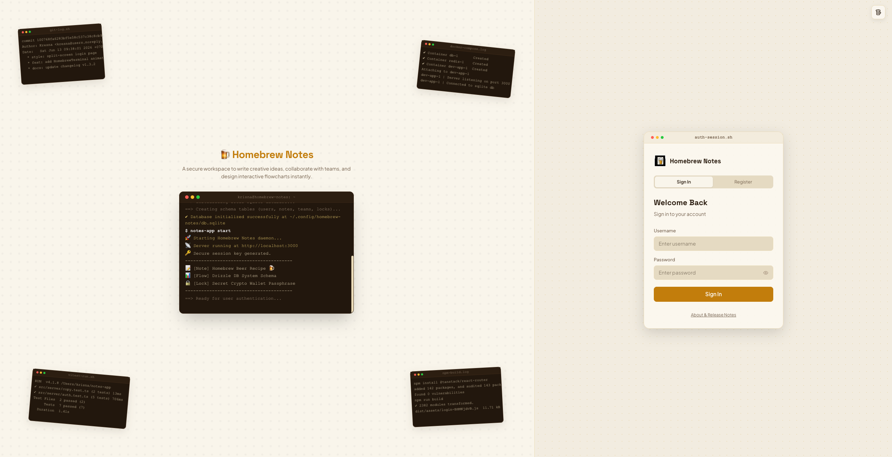

# 📓 Homebrew Notes App

A modern notes application powered by a rich-text block editor, team workspace capabilities, and an autonomous, agentic AI assistant. Designed as a robust monorepo, this platform bridges standard note-taking with deep AI-assisted editing, automated summarization, and web-intelligence retrieval tools.

---

## 🏗️ Architecture Overview

The system is designed as a modern decoupled web app split into two main subsystems:
1. **Frontend & BFF Server (`apps/web`)**: A React 19 app powered by TanStack Router and TailwindCSS 4, using a Node.js BFF (Backend For Frontend) for database operations and file parsing.
2. **AI Agent Backend (`apps/ai-agent`)**: A FastAPI Python application orchestrating the agentic workflows, conversational memory, tool integration, and celery-driven background agents.

### 🖥️ Layer 1: Web Workspace (`apps/web`)
* **Client-Side Interface**: React 19 single-page application built with Vite 8 and typed client routing via TanStack Router.
* **BFF (Backend-For-Frontend)**: A Node.js API server running via `tsx`. It directly reads/writes local note states using **Drizzle ORM** with **SQLite** (`web.db`).
* **Document Parsers**: Local handlers to extract text from uploads (`.docx`, `.xlsx`, `.md`, `.txt`, `.json`).

### ⚡ Layer 2: AI Agent Workspace (`apps/ai-agent`)
* **FastAPI Web Service**: Core Python 3.13 API that manages live conversational sessions and houses the Agent configurations.
* **OpenAI Agents Engine**: Orchestrates active agents, session databases, and streaming logic.
* **Celery Background Workers**: Offloads intensive tasks (like document summarization and metadata tagging) asynchronously to background workers via a **Redis** message queue.
* **Agent Database**: An SQLite database (`sessions.db`) managed via `aiosqlite` / SQLAlchemy to persist session logs and conversational memory.

---

### 🔄 Request & Communication Flow
1. **User Interaction**: The client browser communicates with the Web BFF server via standard HTTP and WebSocket protocols.
2. **Local CRUD Operations**: Document creation, file attachments, and note updates are stored immediately inside the main `web.db` database.
3. **AI Chat Requests**: Chat inputs and document modifications are proxied by the BFF server to the FastAPI backend.
4. **Agent Prompts**: The FastAPI agent server communicates with **OpenRouter** (Gemini 2.5 Flash) to generate text reasoning and streaming answers.
5. **Background Task Offloading**: Long-running requests (e.g. summarizing documents or scanning URLs with **DuckDuckGo**) are sent as Celery tasks to the **Redis** broker. Celery workers perform the task, invoke LLM APIs if needed, and write results back to the agent's `sessions.db`.

---

## 📸 Screenshots

### Login Page
*(Hosted at [notes.zerohero.my.id](https://notes.zerohero.my.id))*



---

## 🛠️ Tech Stack

### Web Workspace (`apps/web`)
* **Frontend Framework:** React 19 + Vite 8 + TypeScript 6
* **Routing:** TanStack Router (Fully type-safe client-side routing)
* **Styling:** TailwindCSS 4 + CSS variables for native dark/light mode theming
* **Text Editor:** TipTap v3 (Block-based rich WYSIWYG editor)
* **Diagram Editor:** ReactFlow (Inline diagrams and flowchart blocks)
* **BFF Runtime:** Node.js + Drizzle ORM + SQLite (`better-sqlite3`)
* **Parsers:** `mammoth` (Word .docx parser), `xlsx` (Excel parser), `marked` (Markdown compiler)

### AI Agent Workspace (`apps/ai-agent`)
* **Framework:** FastAPI (ASGI web application) + Scalar (API documentation)
* **Runtime:** Python 3.13 (Managed via `uv`)
* **Agent Engine:** OpenAI Agents SDK (using standard model wrappers and state trackers)
* **Task Queues:** Celery 5.6 + Redis 7.4 (Message broker for background sub-agents)
* **Agent Database:** SQLite (`aiosqlite` for async state access)
* **Tools Engine:** DuckDuckGo Search API integrations for real-time web searches and markdown content extraction

---

## 🌟 Key Features

### 1. Advanced Note Editing
* **TipTap Block Editor:** A full-featured WYSIWYG block editor with slash commands (`/` menu), list styles, code-blocks with syntax highlighting, and text highlighters.
* **Visual Diagrams:** Insert, render, and edit flowcharts and network diagrams visually inside your notes using **ReactFlow**.
* **Universal Parser & Importer:** Directly parse and import text from `.docx`, `.xlsx`, `.md`, `.txt`, and `.json` files into the block editor workspace.
* **Rich Attachments:** Upload and manage arbitrary files and images nested within individual blocks.

### 2. Note & Workspace Management
* **Workspace Isolation:** Instantly toggle between **Individual (Personal) Notes** and shared **Team Notes**.
* **Daily Logs:** Create and compile date-stamped developer or personal journals in a single click.
* **Dynamic Sidebar:** A resizable panel that automatically organizes notes chronologically (Today, Yesterday, Older).
* **Fuzzy Title Search:** Fast search capabilities to instantly locate notes by title and contents.

### 3. Sharing & Privacy
* **Note Lock:** Protect sensitive or personal note sheets behind a custom 4-digit PIN.
* **Public Web Sharing:** Generate custom access tokens to share notes on the web.
* **Link Access Controls:** Toggle optional password or PIN credentials for public share links.

### 4. Interactive AI Chat Assistant (Right Sidebar Panel)
* **Real-time Streaming:** Smooth streaming of agent completions and reasoning chains directly to the web client.
* **Collapsible Reasoning Logs:** Follow the step-by-step thinking processes of the AI agents as they evaluate tasks.
* **Action Approvals:** AI actions (like modifying your active notes via `write_notes`) require manual approval ("Approve" / "Reject") before making changes to the live editor, ensuring user control.
* **Smart Auto-Execution:** Automatically executes actions if the prompt's intent clearly specifies authorization (e.g. *"Summarize this document..."*, *"Update my note with..."*).
* **Celery Background Sub-Agents:** Offloads intensive background tasks to asynchronous workers:
  * **Summarizer Agent** (`summarize_expert`): Compiles long text notes into bullet summaries.
  * **Tagger Agent** (`tagger_expert`): Suggests relevant tags based on document content.
* **Web Search Tools:** AI is equipped with tools to search the web, crawl domain lists, and download web page code transformed into markdown format.

### 5. Access & User Management (Admin Dashboard)
* **Registration Controls:** A moderated signup queue where admins approve or reject user requests.
* **Administration Board:** Invite new workspace members, assign roles (`admin` or `viewer`), suspend/activate accounts, and trigger password resets.
* **Profile Manager:** Let users change their credentials securely via a modal dialog.

---

## 🚀 Installation & Setup

### Option 1: Using Docker Compose (Recommended)
This spins up Redis, the web application, FastAPI agents, and Celery background workers automatically.

1. **Clone the Repository & Navigate**
   ```bash
   git clone <repository-url>
   cd notes-app
   ```

2. **Configure Environment Variables**
   Copy `.env.example` in the root folder to `.env`:
   ```bash
   cp .env.example .env
   ```
   Open `.env` and fill in your OpenRouter details:
   ```env
   OPENROUTER_API_KEY=your_actual_api_key_here
   ```

3. **Spin up Services**
   ```bash
   docker-compose up -d --build
   ```

4. **Access Applications**
   * **Web UI:** `http://localhost:3000`
   * **AI Agent API Docs:** `http://localhost:8000/docs` (Scalar interactive playground)

---

### Option 2: Manual Development Setup
Use this configuration if you wish to run individual systems locally without Docker containers.

#### Prerequisites
* **Node.js** (v18 or higher)
* **Python** (v3.13 or higher)
* **uv** (Fast Python package manager)
* **Redis** (Installed and running on port `6379`)

#### Setup Steps

1. **Configure Environment Variables**
   Create a `.env` file in the root folder matching `.env.example` and supply your OpenRouter credentials.
   ```bash
   cp .env.example .env
   ```

2. **Install Workspace Dependencies**
   Run the monorepo helper script to install npm packages and Python dependencies simultaneously:
   ```bash
   npm run monorepo:install
   ```
   *(This runs `npm install` in the root and `uv sync` in `apps/ai-agent`)*

3. **Start Redis Service**
   Ensure Redis is running locally:
   ```bash
   # MacOS Homebrew example
   brew services start redis
   ```

4. **Start Background Celery Workers**
   In a separate terminal tab, start Celery to process background task queues:
   ```bash
   npm run ai:celery
   ```

5. **Start Dev Servers**
   To launch both the Web client (Vite) and AI backend (FastAPI) concurrently:
   ```bash
   npm run dev:all
   ```

   * The web application will launch at `http://localhost:3000`
   * The AI API will launch at `http://localhost:8000`

---

## ⚙️ Environment Variables

The application references a single `.env` file located in the root workspace.

| Key | Description | Default | Required |
| :--- | :--- | :--- | :--- |
| `OPENROUTER_API_KEY` | OpenRouter authentication API Key | None | **Yes** |
| `OPENROUTER_MODEL` | The LLM model used for streaming responses | `google/gemini-2.5-flash:free` | No |
| `OPENROUTER_BASE_URL` | Base API URL endpoint | `https://openrouter.ai/api/v1` | No |

---

## 🖥️ Commands Reference

You can execute these scripts from the root directory of the project:

| Command | Description |
| :--- | :--- |
| `npm run monorepo:install` | Installs both Node modules and Python environments. |
| `npm run dev:all` | Launches the React Vite frontend and FastAPI server concurrently. |
| `npm run dev` | Runs only the web application client. |
| `npm run ai:dev` | Runs only the FastAPI Python backend server. |
| `npm run ai:celery` | Starts Celery backend workers locally. |
| `npm run build` | Builds the web application for production. |
| `npm run test` | Runs frontend unit tests. |

---

## 📄 License
This project is licensed under the terms of the MIT license.
